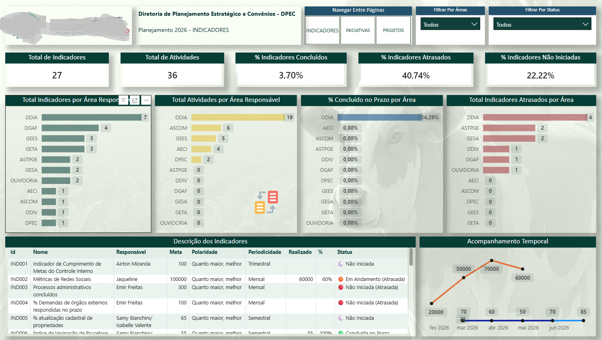
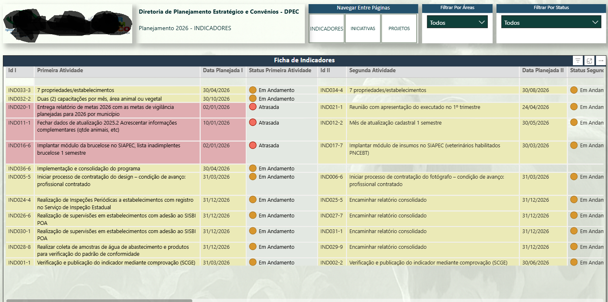
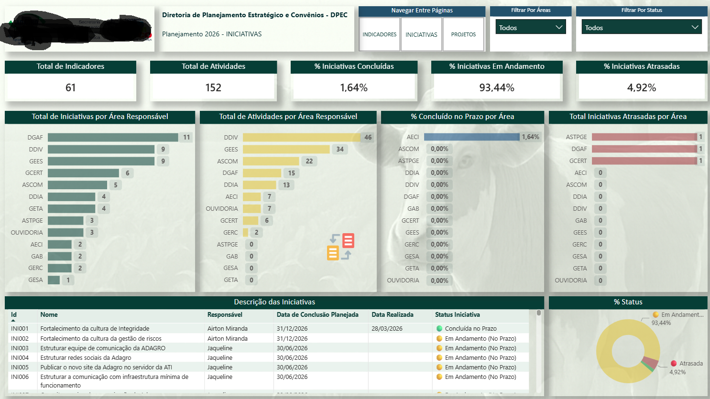
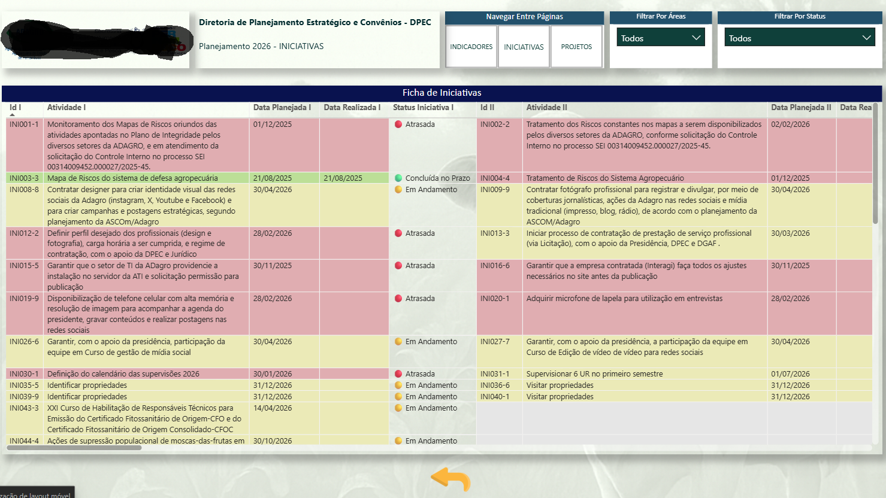
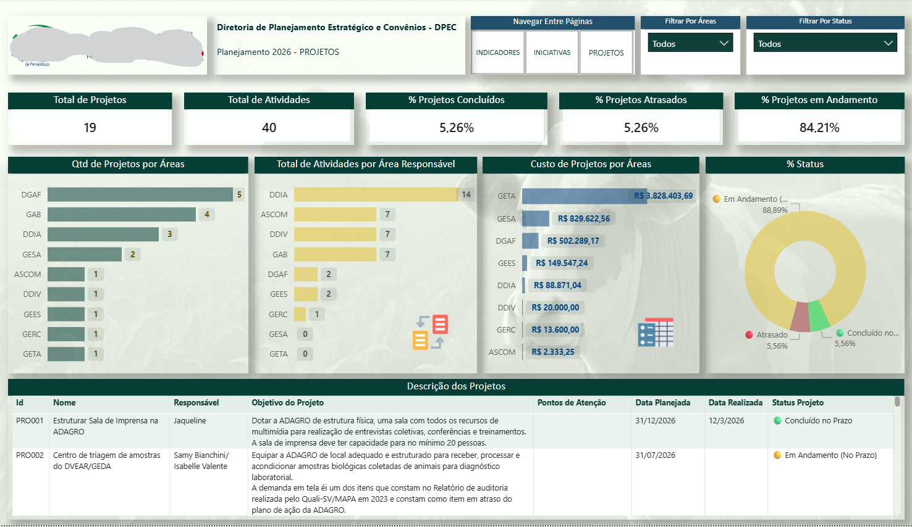

# 📊 Strategic Planning Analytics – Planejamento Estratégico (Indicadores, Iniciativas e Projetos)

Dashboard desenvolvido em Power BI para gestão completa do planejamento estratégico, permitindo o acompanhamento de indicadores, iniciativas e projetos com visão integrada de desempenho e execução.

---

## 📌 Problema de Negócio

A organização não possuía uma visão centralizada do planejamento estratégico, dificultando:

- Monitoramento de indicadores  
- Acompanhamento de iniciativas e projetos  
- Controle de prazos e status  
- Análise de desempenho por área  
- Tomada de decisão baseada em dados  

---

## 💡 Solução Desenvolvida

Desenvolvimento de um sistema analítico em Power BI com múltiplas visões interativas, permitindo:

- Monitoramento de indicadores estratégicos  
- Acompanhamento de iniciativas e projetos  
- Controle de status (Concluído, Em andamento, Atrasado)  
- Análise por áreas responsáveis  
- Acompanhamento temporal da execução  

---

## 🏗️ Estrutura do Dashboard

O projeto foi estruturado em três módulos principais:

### 📌 Indicadores
- Visão geral dos indicadores  
- Percentual concluído, atrasado e não iniciado  
- Distribuição por área responsável  
- Ficha detalhada dos indicadores  

### 🚀 Iniciativas
- Monitoramento de iniciativas estratégicas  
- Controle de andamento e prazos  
- Distribuição por áreas  
- Ficha detalhada das iniciativas  

### 📁 Projetos
- Gestão de projetos estratégicos  
- Acompanhamento de custos  
- Status dos projetos  
- Ficha detalhada e visão financeira  

---

## 📊 Indicadores Principais

- Total de Indicadores  
- Total de Iniciativas  
- Total de Projetos  
- % Concluído  
- % Em andamento  
- % Atrasado  
- % Não iniciado  
- Custo total de projetos  

---

## 🧠 Insights

- Alto volume de iniciativas em andamento  
- Baixo percentual de conclusão de indicadores  
- Concentração de atividades em áreas específicas  
- Identificação de gargalos por área  
- Controle financeiro dos projetos  

---

## 🧭 Funcionalidades

- Navegação entre páginas (Indicadores, Iniciativas e Projetos)  
- Filtros dinâmicos por área e status  
- Drill-down por área responsável  
- Visualização temporal  
- Integração entre gráficos e tabelas  
- Fichas detalhadas (indicadores, iniciativas e projetos)  

---

## 🛠️ Tecnologias

- Power BI  
- DAX  
- Power Query  

---

## 🌍 Componentes Visuais

- Cartões de indicadores (KPIs)  
- Gráficos de barras (ranking por área)  
- Gráficos de linha (acompanhamento temporal)  
- Gráficos de rosca (status)  
- Tabelas detalhadas  
- Navegação por botões  

---

## 📷 Dashboard

### 📌 Indicadores

### 🚀 Iniciativas

### 📁 Projetos

---

## 🚀 Aplicação Prática

Este dashboard permite:

- Acompanhar a execução do planejamento estratégico  
- Identificar atrasos e gargalos  
- Apoiar decisões gerenciais  
- Melhorar o controle de iniciativas e projetos  
- Monitorar desempenho por área  

---

## 📌 Conclusão

Projeto voltado para gestão estratégica, consolidando indicadores, iniciativas e projetos em uma única visão analítica, proporcionando maior controle, transparência e suporte à tomada de decisão.

---

## 📥 Download do Projeto

O arquivo Power BI (.pbix) pode ser disponibilizado via GitHub Releases.

---
